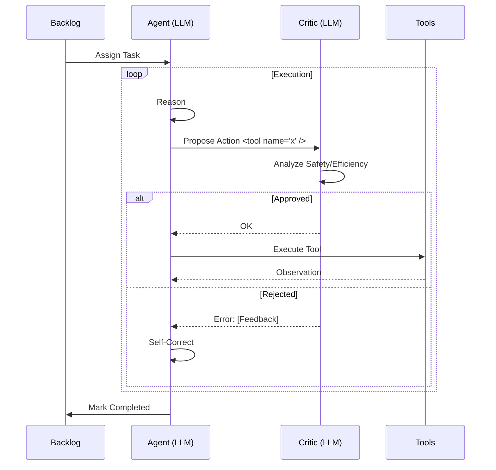

# Kaizen Cognitive Architecture

This document describes the internal "Thinking Loop" of the Kaizen agent.

## 1. The Reflexive Loop (Level 3 Autonomy)

Unlike standard ReAct agents that blindly execute tool calls, Kaizen implements an **Adversarial Reflection** layer.

## 2. Core Components

### `kaizen_core/models.py`
The "Truth" layer. Defines the data schemas for Tasks, ToolActions, and CritiqueVerdicts using Pydantic.

### `kaizen_core/backlog.py`
The "Persistence" layer. Uses SQLite with WAL (Write-Ahead Logging) to manage task states across multiple agent instances.

### `kaizen_core/llm.py`
The "Communication" layer. Handles connectivity to Ollama/OpenAI with automatic retries via `tenacity`.

### `kaizen_core/tools/manager.py`
The "Boundary" layer. Enforces path-traversal protection and command whitelisting.

## 3. Recursive Self-Improvement (RSI)
Kaizen improves itself by modifying the files in `skills/`.
1. **Retrospective:** After each task, the agent analyzes if a new skill should be extracted.
2. **Implementation:** The agent writes a new `SKILL.md` to the `skills/` folder.
3. **Activation:** The updated skill is loaded in the next session, increasing the agent's capabilities permanently.
