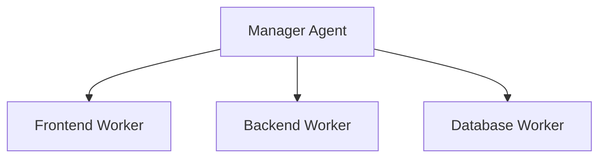
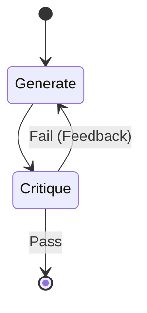

# Protocol: Agent Architecture & Orchestration

> "Structure determines function. Communication ensures safety."

## 1. Topologies

### The Hierarchy (Manager-Worker)
Best for: Defined tasks (e.g., "Build an App").


### The Mesh (Peer-to-Peer)
Best for: Creative exploration (e.g., "Research and Debate").
- Agents post finding to a shared bus.
- No central bottleneck.

## 2. Core Operational Patterns

### Router Pattern (The Switchboard)
One input, multiple potential handlers based on task classification.

### Evaluator-Optimizer (The Loop)


## 3. Communication Standards (SHP)
When an agent hands over a task, it MUST include a **Handover Metadata Header**:

```markdown
---
AGENT_ID: [Agent Name]
OBJECTIVE: [Current Task]
LAST_ACTION: [Tool Called]
RESULT: [Success/Fail/Blocked]
NEXT_STEP_IMPERATIVE: [What the next agent MUST do]
---
```

## 4. Local Swarm Protocols
- **MAX_CONCURRENCY**: `min(cpu_cores - 2, 4)`. Protect host resources.
- **Context Isolation**: Workers share *outputs*, not *history*.
- **Conflict Resolution**: Decisions are based on **Truth Always**. Use a "Boss" agent to arbitrate.

## Architecture Checklist
- [ ] **State Management**: Redis/File?
- [ ] **Handover**: Is the Metadata Header present?
- [ ] **Sandboxing**: Is tool execution isolated?
- [ ] **Max Turns**: Is there a safety circuit breaker for loops?

## Related Skills
- [Agent Identity](../agent-identity/SKILL.md)
- [Stability Protocols](../stability-protocols/SKILL.md)
- [Precision Coder](../precision-coder/SKILL.md)
