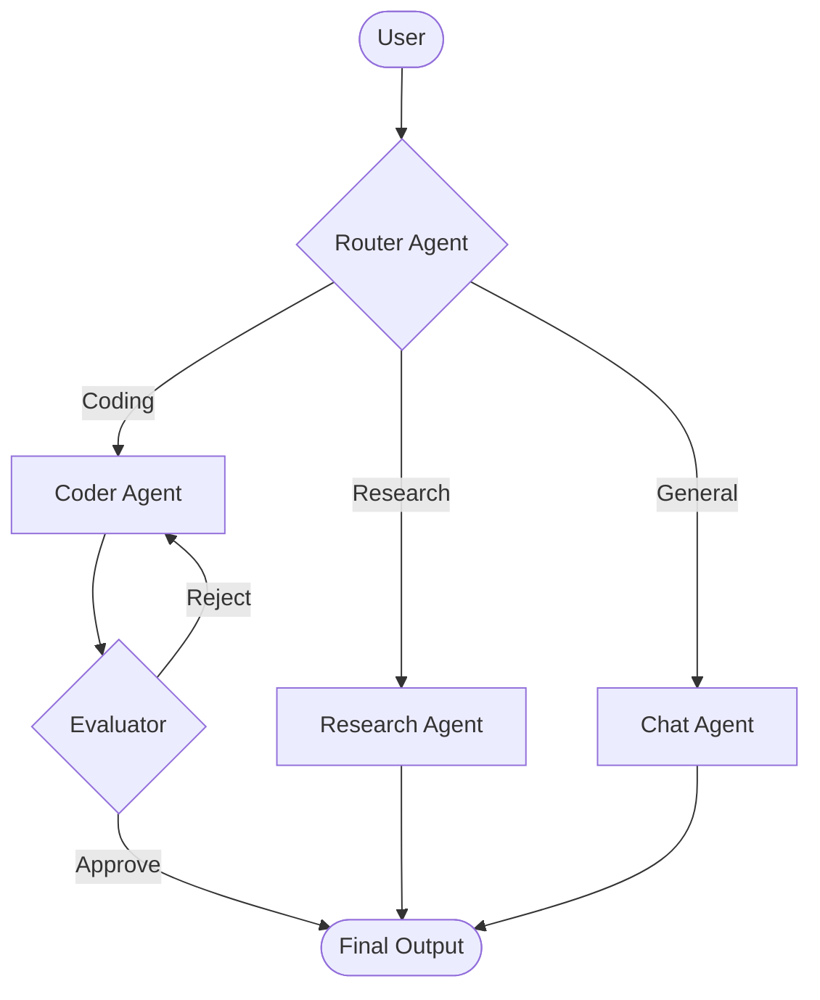
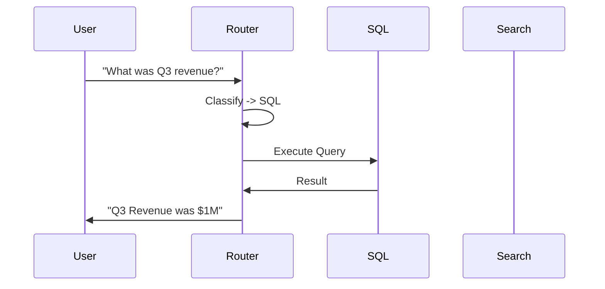
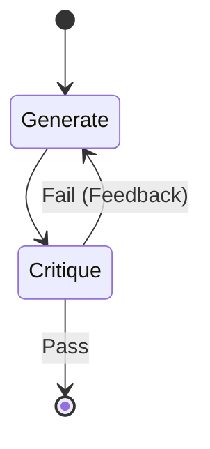

# Agent Architecture

> "Structure determines function."

## Activation Trigger
- Designing a new multi-agent system.
- Routing logic is becoming complex.
- Need to parallelize tasks (Swarm).

## Visual Map



## Protocol: The Core Patterns

### 1. Router Pattern (The Switchboard)
**Use when:** One input, multiple potential handlers.



### 2. Worker Swarm (The Parallel Process)
**Use when:** Massive parallelizable tasks (Map-Reduce).

```python
# Swarm Logic
with ThreadPoolExecutor() as executor:
    futures = [executor.submit(research_agent.run, c) for c in companies]
    results = [f.result() for f in futures]
aggregator_agent.summarize(results)
```

### 3. Evaluator-Optimizer (The Loop)
**Use when:** Quality > Speed.



## Architecture Checklist
- [ ] **State Management:** Redis/Memory/File?
- [ ] **Loop Prevention:** `max_turns` limit?
- [ ] **Tool Sandboxing:** Docker/e2b?
- [ ] **Observability:** LangSmith/Phoenix traces?

## Self-Repair Protocol
When the architecture fails:
- **Bottleneck:** If Router is slow -> Switch to Swarm (Parallel).
- **Hallucination:** If Worker lies -> Add Evaluator (Verification).
- **Looping:** If Agents argue -> Add "Boss" (Conflict Resolution).


## Related Skills
- [Sovereign Identity](../sovereign-identity/SKILL.md)
- [Agent Communication](../agent-communication/SKILL.md)
- [Agent Cowork](../agent-cowork/SKILL.md)
- [Agent Security](../agent-security/SKILL.md)
