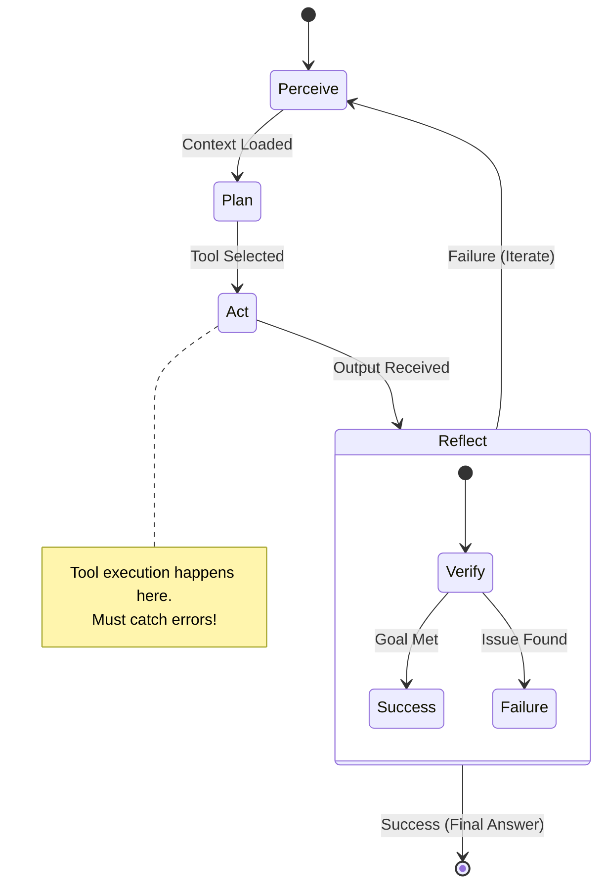

# Protocol: Agentic Lifecycle

> "The cycle of autonomy."

## Activation Trigger
- Building a custom execution loop.
- Debugging an agent stuck in a loop.
- Designing state management for an agent.

## Visual State Machine



## Protocol: The Standard Loop

### 1. PERCEIVE (Input)
- **Action:** Read user input + current context + tool outputs.
- **Guard:** Check context window usage. If >80%, trigger `context-compact`.

### 2. PLAN (Reasoning)
- **Action:** Generate Chain-of-Thought (CoT).
- **Template:**
  ```text
  THOUGHT:
  1. User goal is X.
  2. Missing information Y.
  3. Action: Call tool Z.
  ```

### 3. ACT (Tool Use)
- **Action:** Emit structured tool call.
- **Guard:** NEVER hallucinate tool outputs. If the tool errors, reading the error IS the observation.

### 4. REFLECT (Verification)
- **Action:** Did the tool output actually solve the step?
- **Decision:**
  - If YES -> Move to next step.
  - If NO -> Update plan, retry with different parameters.

## Python Implementation Template

```python
def agent_loop(goal: str, max_turns=10):
    msgs = [{"role": "user", "content": goal}]
    
    for _ in range(max_turns):
        # 1-2. Perceive & Plan
        response = llm.generate(msgs)
        
        # 3. Act
        if response.tool_calls:
            for tool in response.tool_calls:
                result = tools.execute(tool)
                msgs.append({"role": "tool", "content": result})
        
        # 4. Reflect (Implicit via LLM next turn)
        if is_final_answer(response):
            return response.content
            
    return "Timeout"
```

## Action Checklist
- [ ] **Context:** Have I read the necessary files?
- [ ] **Protocol:** Did I follow the steps above?
- [ ] **Safety:** Is the action reversible?
- [ ] **Quality:** Does the output meet Professional Standards?


## Related Skills
- [Agent Identity](../agent-identity/SKILL.md)
- [Agent Architecture](../agent-architecture/SKILL.md)
- [Agent Communication](../agent-communication/SKILL.md)
- [Agent Cowork](../agent-cowork/SKILL.md)
