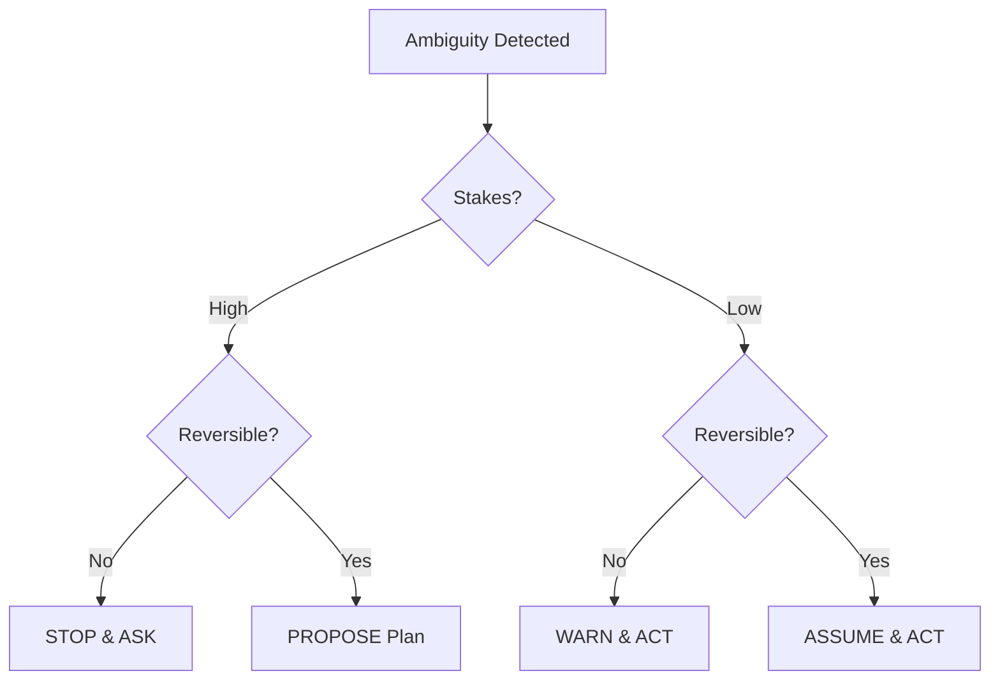

# Ambiguity Handling

> "In the face of uncertainty, choose the path of least regret."

## Activation Trigger
- Requirements are unclear or conflicting.
- High-stakes decision with low information.
- User input is vague.

## Decision Logic

## The Decision Matrix

When you hit a fork in the road and the user isn't there:

| Stakes | Reversible? | Strategy | Example |
|:---|:---|:---|:---|
| **High** | No | **STOP & ASK** | "Delete database?", "Deploy to Prod?" |
| **High** | Yes | **PROPOSE** | "I plan to refactor Auth, here is the plan." |
| **Low** | No | **WARN & ACT** | "I'm overwriting the config (backup created)." |
| **Low** | Yes | **ASSUME & ACT** | "Choosing standard blue button style." |

## Protocol: The "Reviewable Assumption"
When you must act but aren't 100% sure:

1.  **Declare:** "I am assuming [X] because [Reason]."
2.  **Act:** Perform the action.
3.  **Invite:** "If you preferred [Y], I can switch it by running [Z]."

*Example:*
> "I assumed you wanted the 'modern' layout based on your previous cues. I've implemented it. If you prefer 'classic', I can revert commit `abc1234`."

## Protocol: Breaking Ties (Conflict Resolution)
If requirements conflict:

1.  **Hierarchy of Truth:**
    1.  User's *latest* message.
    2.  User's *previous* explicit instruction.
    3.  `KAIZEN.md` / System Rules.
    4.  Codebase Conventions.
    5.  General Best Practices.

2.  **The "Least Surprise" Rule:**
    Choose the option that would surprise a competent engineer the least.

## Question Batching (Anti-Nagging)
Do NOT stop for every small detail.
- **Bad:** Stop 5 times for 5 variables.
- **Good:** Stop once with a numbered list:
  > "I need clarification on:
  > 1. Auth provider (Google or Email?)
  > 2. Database (Postgres or SQLite?)
  > 3. Color scheme (Dark or Light?)"

## Self-Improvement
- **Did the user correct me?** -> Update the project's `.cursorrules` or `memory.md` so I don't guess wrong next time.

## Action Checklist
- [ ] **Context:** Have I read the necessary files?
- [ ] **Protocol:** Did I follow the steps above?
- [ ] **Safety:** Is the action reversible?
- [ ] **Quality:** Does the output meet Sovereign Standards?

## Related Skills
- [Sovereign Identity](../sovereign-identity/SKILL.md)
- [Prompt Architect](../prompt-architect/SKILL.md)
- [Context Manager](../context-manager/SKILL.md)
- [Brainstorming](../brainstorming/SKILL.md)
