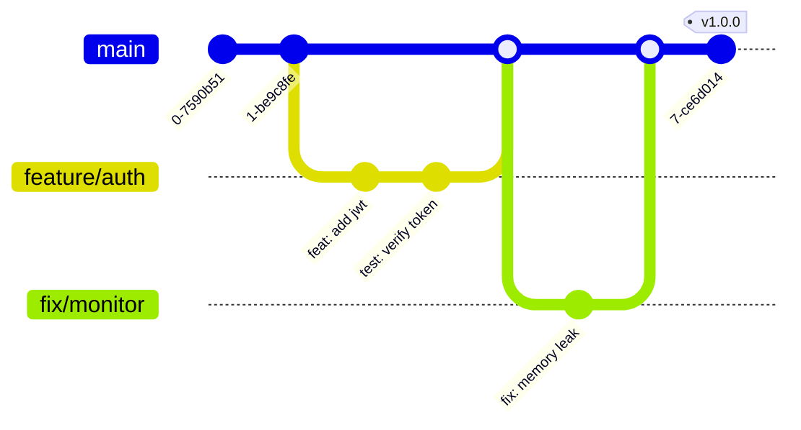

# Git Workflow

> "History is written by the victors (who squash their commits)."

## Activation Trigger
- Managing branches or commits.
- Resolving merge conflicts.
- Using advanced Git features (worktrees, rebase).

## Visual Branching Strategy



## Branch Naming
- `feature/kb-integration`
- `fix/login-timeout`
- `refactor/database-layer`
- `chore/upgrade-deps`

## Conventional Commits

| Type | Meaning | Example |
|:---|:---|:---|
| **feat** | New feature | `feat(auth): add google sso` |
| **fix** | Bug fix | `fix(api): handle timeout 500s` |
| **docs** | Documentation | `docs: update readme badges` |
| **chore** | Tooling | `chore: update .gitignore` |
| **refactor** | clean up | `refactor: extract logic to util` |

**Format:**
`type(scope): imperative description`

## Advanced Workflows

### 1. Git Worktrees (Parallel Dev)
Stop switching branches. Use parallel folders.
```bash
# Create detached folder for hotfix
git worktree add ../hotfix-folder hotfix/login-bug

# Work there, commit, push
cd ../hotfix-folder
git push origin hotfix/login-bug

# Delete when done
cd ../main-repo
git worktree remove ../hotfix-folder
```

### 2. Clean History (Interactive Rebase)
Squash messy "wip" commits before merging.
```bash
git rebase -i HEAD~3
# Pick the first, 'squash' the rest
```

### 3. "Oh Shit" Recovery
| Situation | Command |
|:---|:---|
| Undo commit (keep files) | `git reset --soft HEAD~1` |
| Undo commit (delete files) | `git reset --hard HEAD~1` |
| Edit last message | `git commit --amend` |
| Forgot to add file | `git add . && git commit --amend` |

## Pre-Push Checklist
- [ ] `git status` is clean
- [ ] `npm test` passes
- [ ] No `console.log` left behind
- [ ] No secrets in `git diff`


## Related Skills
- [Identity](../sovereign-identity/SKILL.md): The core constraints.
- [Python Automation Expert](../python-automation-expert/SKILL.md)
- [Python Development](../python-development/SKILL.md)
- [React Ts Expert](../react-ts-expert/SKILL.md)
