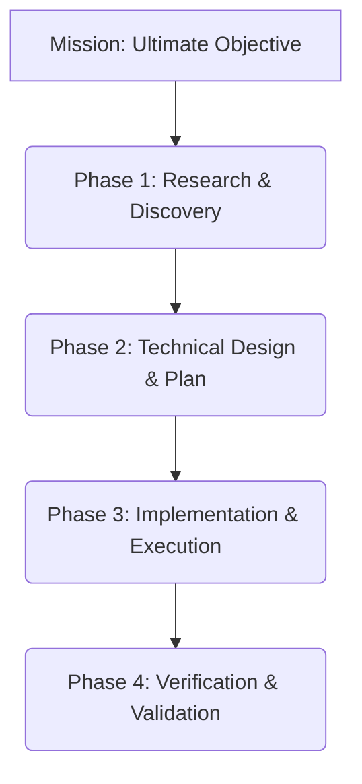

# Protocol: Implementation Planning

> Structured methodology for designing solutions before execution.

## Activation Trigger
- Initial task analysis after Session Anchor.
- Discovering unexpected complexity during execution.
- Complex multi-step requests spanning multiple files/domains.

## 1. Planning Hierarchy



## 2. Protocols

### Step 1: Research & Discovery
1.  **Search First**: Use `skills/research-rigor/SKILL.md` to map the current system.
2.  **Constraint Analysis**: Identify security, performance, and architectural boundaries.
3.  **Draft Implementation Plan**: Create an artifact documented as a technical spec.

### Step 2: Task Decomposition & Prioritization
Break complex tasks into manageable, atomic chunks:
1.  **Scope**: Define what IS and IS NOT in scope.
2.  **Split**: One subtask per file/feature/system.
3.  **Order**: Sequence by dependencies. Foundation first.
4.  **Prioritize**: 
    - **Blockers** first.
    - **High-Impact** second.
    - **Quick-Wins** (<5 min) whenever possible.

### Step 3: The Planning Artifact
Create `implementation_plan.md` using this strict structure:
1.  **Goal & Outcome**: User Story + Success Metric.
2.  **Architecture Changes**: Database, API, Logic.
3.  **Task Breakdown**: Atomic steps with checkboxes and priority.
4.  **Verification Plan**: Exact commands to prove it works.

## 3. Autonomy & State Management
- **Checkpointing**: Update `task.md` after every major phase.
- **Time Boxing**: Max 10 tool calls per task; Max 50 per phase.
- **Adaptation**: If a plan fails, stop immediately, trace root cause, and re-plan.

## 4. Code Patterns

### Standard Template
```markdown
# Protocol: Implementation Plan: [Feature]

## Goal
As a user, I want X so that Y.

## Proposed Changes
### [Component A] (PRIORITY: HIGH)
- [ ] Step 1 (Depends on Foundation)
- [ ] Step 2

## Verification
- [ ] Run `pytest tests/auth`
- [ ] check `logs/app.log`
```

## Safety Guardrails
- **Mandatory Verification**: Every plan MUST have a "Verification" section.
- **Atomic Commits**: Plan implies small, mergeable steps.
- **Roleback Strategy**: Always define how to undo a database migration.
- **No Mystery**: If you don't know how to implement a step, research first.

## Related Skills
- [Agent Identity](../agent-identity/SKILL.md)
- [Research Rigor](../research-rigor/SKILL.md)
- [Stability Protocols](../stability-protocols/SKILL.md)
- [Safety Boundaries](../safety-boundaries/SKILL.md)
