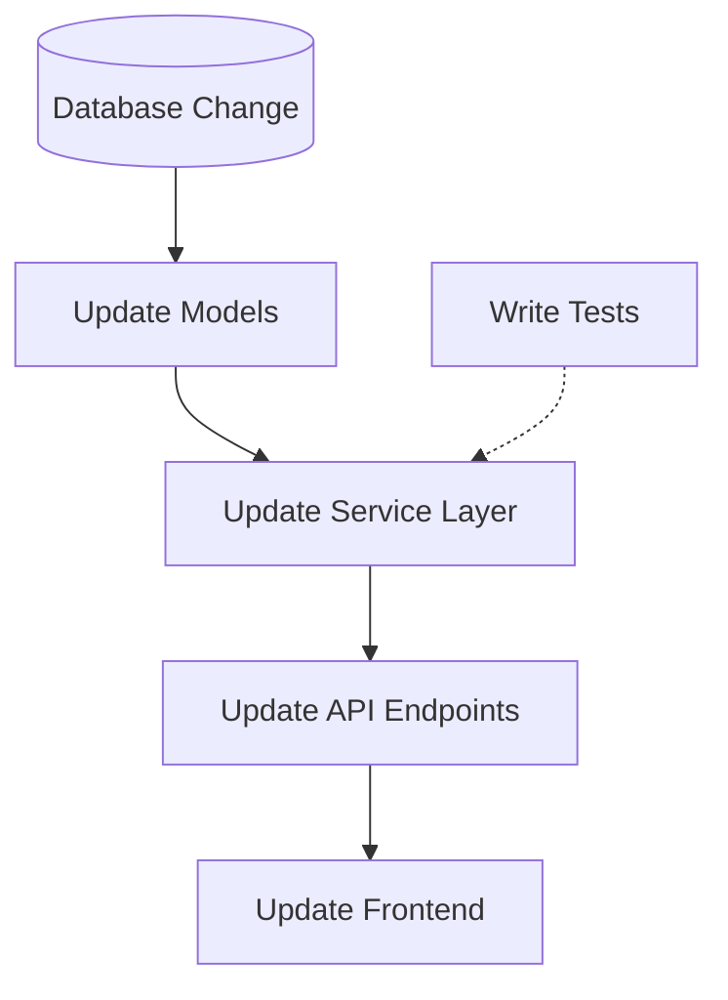

# Implementation Planning

> "Measure twice, cut once."

## 1. The Planning Template (Artifact)

Create an `implementation_plan.md` before writing code for complex features.

```markdown
# Implementation Plan: [Feature Name]

## 1. Goal & Outcome
**User Story:** As a [User], I want [Action] so that [Benefit].
**Success Metric:** Response time < 200ms.

## 2. Architecture Changes
### Database
- New Table: `users_v2` (migrating from `users`)
- New Index: `idx_email_v2`

### API Layer
- `POST /api/v2/login` (Replaces v1)

## 3. Implementation Steps (Atomic)

### Phase 1: Foundation
- [ ] Create `users_v2` migration.
- [ ] Update ORM models.
- [ ] **Verification:** Run `migrations check`.

### Phase 2: Core Logic
- [ ] Implement `AuthService` class.
- [ ] Unit test `AuthService`.
- [ ] **Verification:** `pytest tests/unit/auth`.

### Phase 3: Integration
- [ ] Wire up API endpoints.
- [ ] Connect to Frontend.
- [ ] **Verification:** E2E smoke test.

## 4. Risks & Rollback
- **Risk:** Migration locks DB.
- **Mitigation:** Run "Concurrently".
- **Rollback:** Standard SQL `DOWN` migration.
```

## 2. Dependency Graphing
Map the order of operations.



## 3. Principles of Planning
1.  **Atomic Commits:** Each step should be one mergeable PR.
2.  **Test-First:** Define *how* you will verify before you build.
3.  **No Dead Ends:** Ensure Step 1 doesn't block Step 3 unexpectedly.
4.  **Legacy Bridge:** If replacing a system, plan the "Dual Write" or "Feature Flag" phase.
