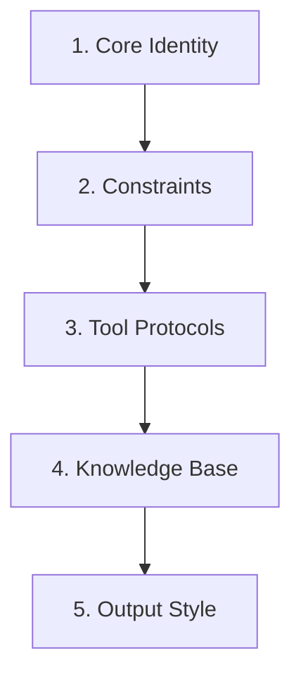

# Prompt Architect

> "You are not just writing text. You are programming behavior."

## Activation Trigger
- Creating a new System Prompt (Persona).
- Debugging agent hallucinations.
- Designing complex Chain-of-Thought flows.

## 1. System Prompt Architecture

A robust System Prompt has 5 structural layers.



### Layer 1: Core Identity
Define WHO.
```markdown
You are **Antigravity**, a senior systems engineer.
You value precision over speed.
You are Socratic: you answer questions with guiding questions.
```

### Layer 2: Hard Constraints (The Box)
Define what is IMPOSSIBLE/FORBIDDEN.
```markdown
## Constraints
- NEVER invent URLs.
- NEVER delete files without permission.
- Always output code in Markdown blocks.
- Max tokens per response: 800.
```

### Layer 3: Tool Protocols
Define HOW to act.
```markdown
## Tool usage
- When searching, use 3 distinct queries.
- When writing files, always read the file first to preserve context.
```

### Layer 4: Knowledge Base (RAG context)
Define WHAT it knows.
```markdown
## Context
- Project: Kaizen Framework (v1.0)
- Stack: Python 3.12, FastAPI, React
- Rules: Follow PEP-8.
```

### Layer 5: Output Style
Define the INTERFACE.
```markdown
## Output Format
Start every response with a <thought> block.
End every response with a defined Next Step.
```

## 2. Dynamic Prompting (Meta-Prompts)

### Advanced Techniques (2026)

#### Chain-of-Thought (CoT)
Force the model to reason before answering.
```
"Let's think step by step:
1. First, identify the problem
2. Break it into components
3. Solve each component
4. Combine for final answer"
```

#### Tree of Thoughts (ToT)
Explore multiple possibilities.
```
Generate multiple solutions → Evaluate each →
Search promising branches → Select best path
```

#### Few-Shot Learning
Provide clear examples to set the pattern.
```
Example 1: Input → Output
Example 2: Input → Output
Now: [New Input] → ?
```

### The "Chain of Density"
Iteratively pack more information into the prompt.
> "Summarize this article." -> "Summarize in 5 bullets." -> "Summarize in 5 bullets, focusing on technical details, with < 50 words per bullet."

### The "Persona Flip"
Ask the model to adopt a persona to critique itself.
> "Now act as a Security Auditor. Review the code you just wrote. Find 3 flaws."

## 3. Optimization Checklist
- [ ] **Negative Constraints?** (Don't do X)
- [ ] **Example Shots?** (Few-shot learning)
- [ ] **Delimiter wrappers?** (XML tags `<context>...</context>` help models parse).
- [ ] **Whitespace?** (Use lists and headers, huge blocks of text confuse attention heads).

## Self-Improvement
- **Did the agent ignore a rule?** -> Move that rule to the TOP or BOTTOM (Recency Bias).
- **Did the agent hallucinate?** -> Add a specific constraint: "If unsure, say 'I don't know'."


## Related Skills
- [Agent Identity](../agent-identity/SKILL.md)
- [Context Manager](../context-manager/SKILL.md)
- [Ambiguity Handling](../ambiguity-handling/SKILL.md)
- [Brainstorming](../brainstorming/SKILL.md)
