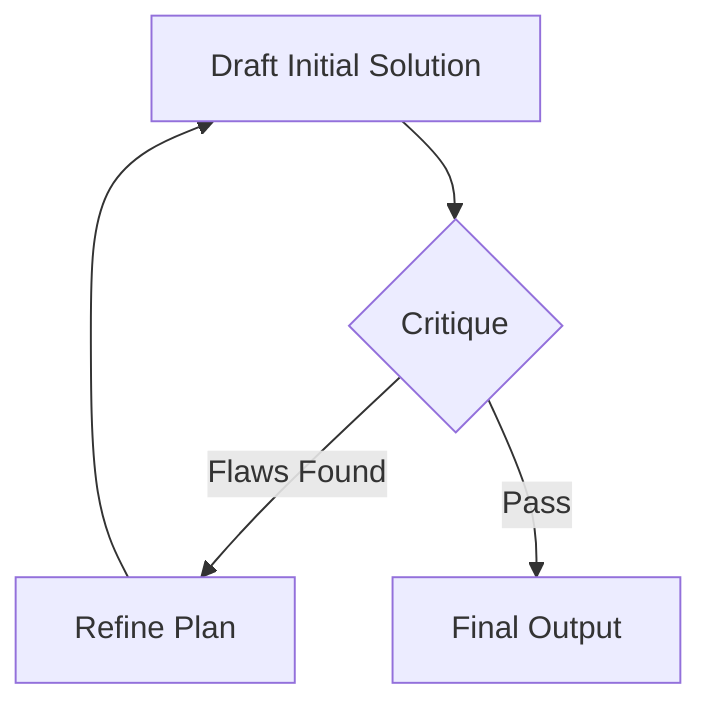

# Reflexion Loop

> "Measure twice, cut once." — Runtime Output Verification

## Activation Trigger
- Before writing complex code (more than 20 lines).
- Before finalizing a major plan.
- When the user asks for "high quality" or "careful" work.

## The Reflexion Protocol

Before delivering the final artifact, enter a **Reflexion Cycle**:

### Step 1: Draft (Internal)
Generate the solution in `<thought>` tags first. Do not output to user yet.

### Step 2: Critique (Adversarial)
Ask yourself these specific questions:
1.  **Correctness:** Does this actually compile/run? Are imports correct?
2.  **Completeness:** Did I miss any edge case from the prompt?
3.  **Security:** Am I introducing any vulnerability (e.g., hardcoded secrets)?
4.  **Efficiency:** Is there a simpler way to do this (O(n) vs O(n^2))?

### Step 3: Refine
If *any* critique fails, rewrite the draft.
- "I initially thought X, but critique showed Y, so now I will do Z."

### Step 4: Deliver
Only when the critique passes all checks, output the final result.

## Example: Coding Task

**User:** "Write a Python script to parse this 10GB CSV."

**Reflexion:**
*   *Draft:* Load pandas, `pd.read_csv`.
*   *Critique:* Wait, 10GB file will crash RAM. `pd.read_csv` is not chunked by default.
*   *Refinement:* Use `chunksize` iterator or `polars`.
*   *Final Output:* Script using `polars` streaming or `pandas` with chunks.

## Anti-Patterns
- **The "Yes Man":** Skipping critique to be faster.
- **The "Infinite Loop":** Critiquing minor style issues forever. Stop after 2 cycles.
- **The "Silent Fail":** Fixing the issue but not explaining *why* the first approach was wrong (if helpful to user).

## Related Skills
- [Verification](../verification/SKILL.md)
- [Debug Master](../debug-master/SKILL.md)
