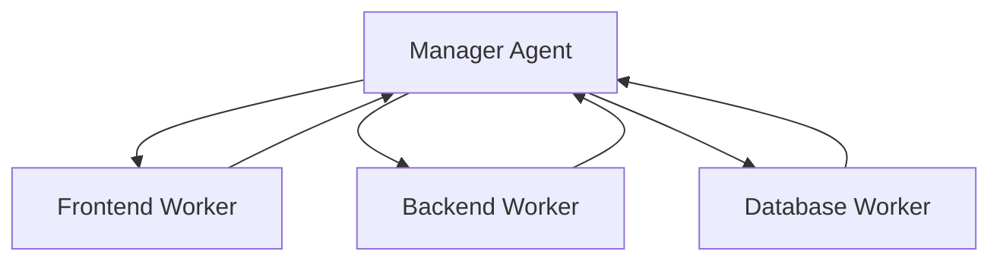

# Swarm Orchestrator

> "None of us is as smart as all of us."

## Activation Trigger
- Designing swarm topologies (Mesh vs Hierarchy).
- Implementing inter-agent messaging.
- Resolving conflicts between agents.

## 1. Topologies

### The Hierarchy (Boss-Worker)
Best for: Defined tasks (e.g., "Build an App").


### The Mesh (Peer-to-Peer)
Best for: Creative exploration (e.g., "Research and Debate").
- Agents post finding to a shared `message_bus`.
- Other agents react to messages they are interested in.
- No central bottleneck.

## 2. The Message Bus Protocol (JSON)
Agents communicate via a shared file or Redis stream.

```json
{
  "id": "msg_123",
  "from": "research_agent",
  "to": "writer_agent",
  "type": "findings_report",
  "payload": {
    "summary": "Competitor X launched feature Y...",
    "source": "url..."
  },
  "timestamp": "2026-02-03T12:00:00Z"
}
```

## 3. Local Swarm (Ollama/Gemini)
How to run a swarm on **one machine**:

1.  **Orchestrator:** Python script (`swarm.py`).
2.  **Workers:** ThreadPool executing API calls.
3.  **Memory:** Shared `sqlite` database.

**Safety Gate:**
- **MAX_CONCURRENCY:** `min(cpu_cores - 2, 4)`. Don't fry the user's laptop.
- **Context Isolation:** Workers do NOT share context history. They share *outputs*.

## 4. Conflict Resolution
When two agents disagree (e.g., Frontend wants Blue, Design wants Red):
1.  **Escalate:** Trigger `Boss` agent.
2.  **Vote:** Majority rule (if >3 agents).
3.  **Random:** (Last resort).
